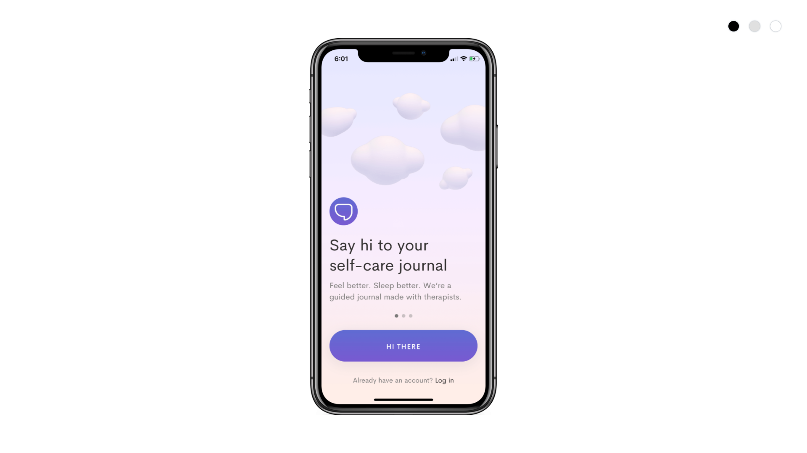
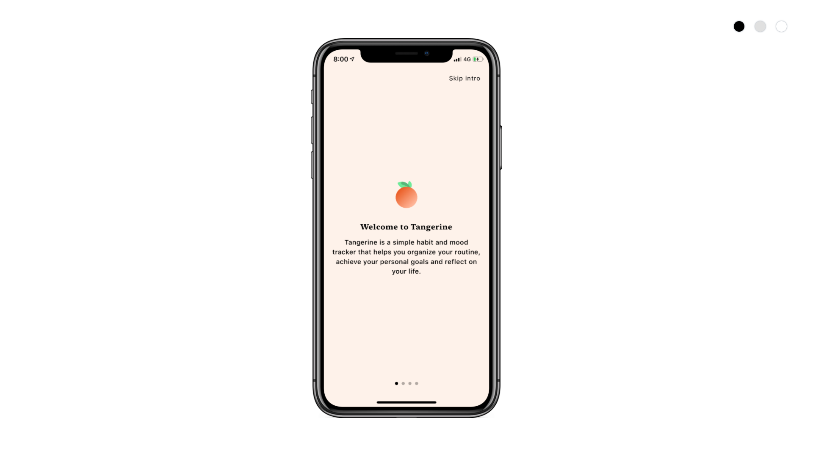
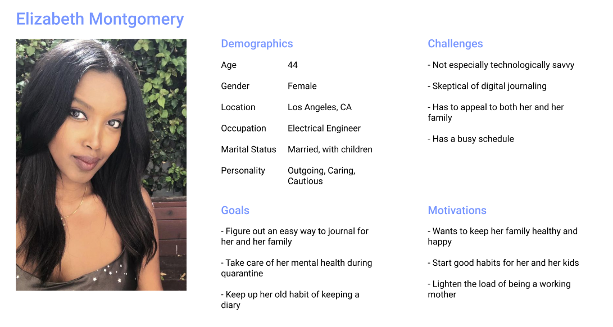
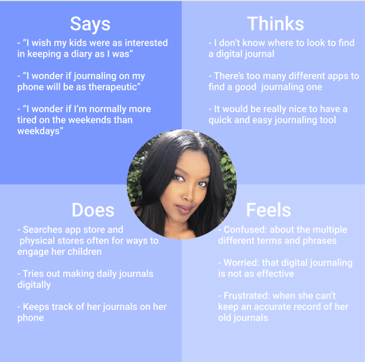
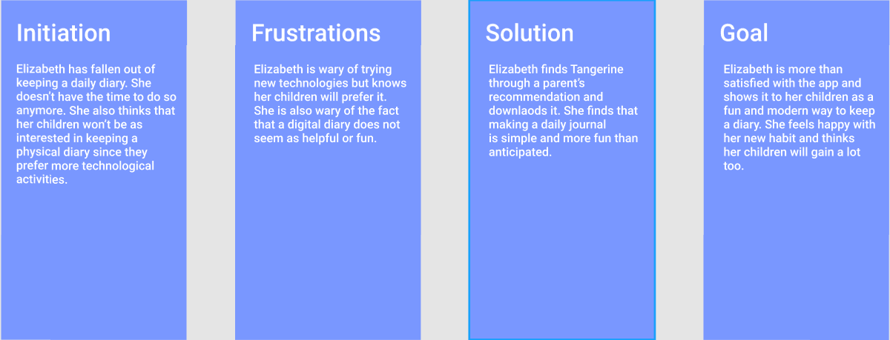

# Digital Diary
## Tai Nguyen  
    
### Introduction
This app is a way to simplify journaling as a digital process and have qualitative stats to show users about the potential benefits. It is a means of translating a typical journal or diary into a digital diary that provides feedback to users. 

### Design Statement
The purpose of this app is to improve mental health of users through a simple, streamlined experience. Journaling is a proven method to improve mental health and doing so daily can have profound effects. In these uncertain times, this digital journaling app can act as a way to clear thoughts and keep track of your own mental health. 

### Competitor analysis:
#### Heuristic Evalution
This is a heuristic analysis of journal/self care tracking apps through the lens of middle aged women. This will be done by assessing two mobile apps, Jour and Tangerine and comment on what has been done well and what aspects can be improved upon. My overall project that builds off this analysis will be the creation of a simple, easy to use journaling/tracking app that improves mental health and productivity for middle aged women. [Read more…](https://github.com/taithnguyen/Assignment-01/blob/main/README.md)

 

 
#### Usability Testing
The Tangerine mobile application is used as a self-care journaling app that helps users keep track of their moods, habits, and thoughts. While the app is mostly simple and straightforward, there were a few usability issues discovered from the heuristic analysis previously done. First, the app seems to be geared towards a younger generation as well as a less formal setting due to some of the vocabulary and emoji icons used. This leads to a mismatch between the app system and real world concepts. Second, there is a lack of direction on the app that could hinder users' effectiveness of self-journaling. This is an issue of visibility of system status. Third, there is extraneous and unclear information regarding some of the important statistics (ie: the graphs or previous moods journaled). This is an issue of aesthetic and minimalist design where not all important information is easily accessible and unimportant information hidden. Thus, I will be conducting this usability test in order to gain user feedback on these 3 potential user issues by completing 3 tasks related to these topics. The goal of this process is to improve the user experience of this app as well as information on how to best optimize self-care journaling apps. [Read more…](https://github.com/taithnguyen/Assignment02/blob/main/README.md)

<iframe src="https://drive.google.com/file/d/1Gga3pcyK8aYNLfpismjgYhUerx5LJ8pI/preview" width="640" height="480"></iframe>

### User research: contextual inquiry
This project aims to support users in their psychological needs. More specifically, this project hopes to give users a reliable way to practice proper journaling and habit tracking in order to maintain health habits in terms of mental and physical activity. As a result of user research, I learned a lot about my own reasoning for creating this project as well as the user's more broad and holistic thoughts on the project as a whole. Some insights that I gleaned from the participant were the overall lack of knowledge about journaling and its potential mental and physical health benefits, the kinds of habits that general user's would like to track, and the potential gains that users predict from beginning journaling. [Read more…](https://github.com/taithnguyen/Assignment-04/blob/main/README.md)
### UX storytelling [persona+scenario, assignment05]
My project revolves around the effects of journaling on mental health of users. However, to understand what kind of effects journaling can and should have on users' mental health, it is necesary to understand the user itself. Therefore, the purpose of UX storytelling in my project in particular is to get within the mind of the user and understand how they may think and feel about certain aspects of journaling and the resulting effects. It also gives an idea for me to understand how to make journaling easiest and most effective for the targeting users. Below, I have shown an example of a persona, empathy map, and journey map for the task of creating a daily journal.

 
 

See all personas, empathy maps, and journey maps [here](https://github.com/taithnguyen/Assignment-05/blob/main/README.md).

### Low-fidelity prototype 
The purpose of this low fidelity prototype is to test how specific users will interact with the features and flow of the app as expected. The most important part is to gain feedback on whether or not the flow of each task is intuitive and clear and thus gain feedback on which improvements should be made. In addition, this prototype will draw on my user research which revealed the lack of knowledge on daily journals and the potential benefits of it. My user research also helped clarify what exactly users want to record and prioritize when it comes to creating daily journals.
Here is a low fidelity prototype of creating a daily journal.

See all low fidelity prototypes [here](https://github.com/taithnguyen/Assignment-06/blob/main/README.md).
### High-fidelity prototype
The main purpose of this design was simplicity and creating a certain mood that would create the intended effect on the user. Since journaling should be a calming and positive activity done normally at night, shades of blue and purple were used. It should be noted that any and all unnecessary features are removed in order to create a simplified process as well as replicate the inspiration of a manual journal. Thus, the two focuses for the design were keeping only necessary features and having a pleasant color that would keep the user comfortable.

<iframe style="border: 1px solid rgba(0, 0, 0, 0.1);" width="800" height="450" src="https://www.figma.com/embed?embed_host=share&url=https%3A%2F%2Fwww.figma.com%2Fproto%2FxhJP5K7QEr330aLit9wzji%2FDH-150-Prototype%3Fnode-id%3D55%253A157%26scaling%3Dmin-zoom" allowfullscreen></iframe>

### Evaluation and revision history 
Summary of findings: Overall, feedback was positive and the few suggestions have been incorporated in the revisions section below. My goal of a simple interface seemed to be achieved. The main suggestions were regarding a few simple fixes that would help the user fix their errors and navigate easier. Since the design is already extremely simplistic, these suggestions were very helpful as any functional fixes would be very impactful.

Revisions: A note of a few of the revisions made after the impression test and cognitive walkthrough: the addition of the home button to each screen during the creation of the journal in order to minimize steps to return home, addition of a slider bar to accomodate for half hours of sleep (ie: 7hr30 of sleep), creation of registering task in order to set personalization and goals.

Full evaluation/impression test/cognitive walkthrough/accessibility test can be found [here](https://github.com/taithnguyen/Assignment-07/blob/main/README.md).
### Pitch video 
### Conclusion: what did you learn throughout the process?
Throughout this entire process, I learned a lot about the design process as a whole. I had created high fidelity prototypes before but had very little experience with the rest of the process. Viewing the process through the lens of accessibility for users and embracing their thoughts and needs was a transformative process for me. Creating surveys, usability tests, personas, and empathy maps are skills that I will utilize in the future. Some key takeaways are the importance of listening to a variety of users from the start, considering accessibility factors such as color contrast and heuristics, and designing with certain personas in mind. 
